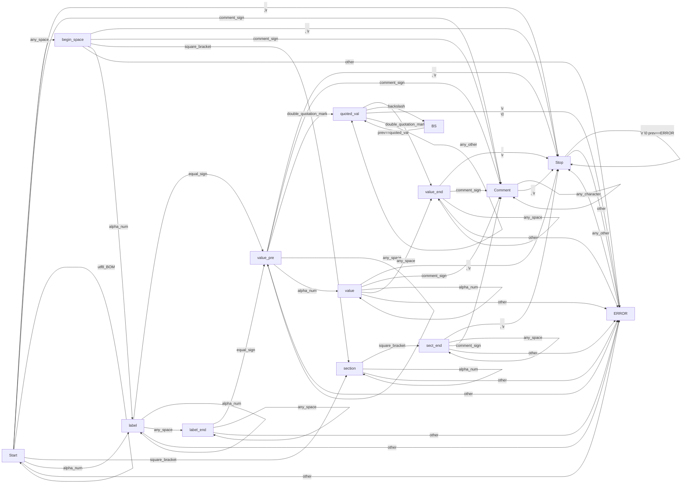

# Lightweight INI style Configuration manager

## Supports (currently)

- Reading & processing sections from file.
- Reading parameter/value pairs from an ini file.
- Converting readed values to int/float/string.
- Building linked list from parameters.
- Multiline values are supported.
- Reading comments.
- UNICODE/UTF8 support.
- Escape sequence support.
  
**Automatically switch** between **UNIX ('\n')** and **Windows ('\r\n')** line endings. MAC ('\r' only) is not supported currently.
**Comments** can be started with **';'** or **'#'** signs.
**Multiline** values are supported if they are surrounded **with Double-Quotation-Mark (")** signs.
Uses Finite State Machine technique for file processing.
**Sections, Parameter names** can be **ASCII** alphabetical or numerical characters.
**Values** in alone also ASCII, or between Double-Quotation-Marks(") can be **any UNICODE/UTF8** characters.

Maximum line length can be 2^(32/2)  characters.

## Future Plans  

- Writing and Rewriting ini files.
- Writing support for comments.
- Modifying one or more values/parameters/sections in ini files.
  
---  

## sample.ini  

```ini
;Comments are started with '#' or ';'
# This is also a comment
; Inline comments are allowed.
; EMPTY/BLANK lines are not processed!

;Global variables are allowed
;# Parameters without section are global variables.
global1 = 11
global2 = aaa

; The First character of Section name should be alphanumerical, but
;# another caharacters can be Alphanumerical or dot(.)/underscore(_)/hyphen(-)/space(' ')
[Sections.are_ASCII-alnum characters]

;Parameter values in itself:
;# can be ASCII Alphanumerical only, without any SPACE or TAB character.
;Should start with alphanumerical, and from the second character,
;# can contain (with dot(.) or underscore(_) or hyphen(-))
;If you want to use other characters, you should enclose them between two double-quotation-mark(") sign.
parameter = value-in_itself-are-Alnum.ascii  

;Parameter names are ASCII alphanumerical only, with additional dot(.) or underscore(_) or hyphen(-) or suare-bracket([/]) characters.
;# Square-brackets([]) are allowed for arrays.
parameter_names.also-ASCII = value
  

[Section 2]
;For other value characters:
;# The Space, or any other special characters are allowed only between two double-quotation-mark sign.

;Escaped characters, (\n, \t, etc.) or multi-byte characters (é, €, カ, ⠋, ঘঃ, 😍) are allowed here.
parameter2 = "I like \t emojis 😍 but, don't like mosquitoes カ ! :)"

; Even! Multiline Parameters are supported:
parameter3 = "With double quotation mark \
I can write multiline values, but I should \
escapse the trailing newline with '\' sign!"
  

[E X A M P L E S]                     ;inline comments are #OK
abcdefgh                              ;WRONG (eqal sign is needed)
abcdefgh =                            ;CORRECT
abcdefgh ==                           ;WRONG (one equal sign allowed)
abcdefgh = "=="                       ;CORRECT
=abcd                                 ;ERROR
= ;xxxx                               ;also will produce ERROR


param=value                           ;OK (inline comments are ok)
   param    = value                   ;OK (you can use any space between Label, equal, and value

param = value1 value2                 #ERROR
param = value1\ value2                #ERROR
paramß = value1_value2                #ERROR (ascii is needed for labels and sections)

[example ;section]                    ;WRONG
[example \;section]                   ;WRONG

param = "qwerty \"qwerty\" abcdefh"   ;CORRECT (you can use backslash in quoted value)
param = "qwerty\nqwerty"              ;CORRECT ('\''n' -> '\n' will be translated to newline (\r, \t, etc also))
param = "qwerty"qwerty                ;WRONG (mixing are not allowed)
param = "qwerty"                      ;OK
param =  qwerty                       ;OK

array[0123] = "asdasd"                ;OK
array [1234] = dfgdfg                 ;WRONG
array[_] = "jkljkl"                   ;OK
array[abc] = aaaa                     ;OK
array.abc = aaaa                      ;OK
array[abc] = ""                       ;OK

#### qwerty $ۧ qwerty ####           ;OK (you can use any character in comments

test = -1.1                           #OK
test2 = "-1.1"                        #OK
test3 = _aaa                          #WRONG
test4 = aaa_                          #OK
test5 = .aaa                          #WRONG
test6 = aaa.                          #OK
test6 = aa.a                          #OK

[server_options]                      ;OK
server_ = ;xxxx                       ;OK
server_ = server.example.com          ;OK
_server_= server.example.com          ;ERROR (labe should start with alpha-numerical character)
ip = 127.0.0.1                        ;OK
ip = "127.0.0.1"                      ;OK
1024 = xxxxx                          ;OK
1024 = 2048                           ;OK (but only syntactically :)


```

---  

## Engine is using a Finite State Machine
  
(Markdown graph)  
(If it does not appear see: engine.html)  


